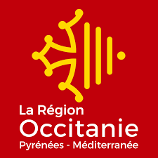

{ width=800px }

## Who are we?

South Green (SG) is a bioinformatics platform based on the [Agropolis campus](http://www.agropolis.org/) gathering Bioinformatics staff from [CIRAD](http://www.cirad.fr/en/), [IRD](http://en.ird.fr/), [INRAE](http://www.international.inra.fr/) and the [Alliance Bioversity international-CIAT](http://www.bioversityinternational.org/).

Based on this strong local community in the field of agriculture, food, biodiversity and environment, this network of national and international scope, develops **bioinformatics applications and resources** dedicated to **genetics and genomics of tropical and Mediterranean plants**.

### South Green offers 3 types of services:

 * Access to [HPC infrastructures](http://www.southgreen.fr/content/computer-facilities) for calculation and storage with more than 400 analytical software  
 * Innovative open access [scientific databases](https://www.southgreen.fr/databases) and [tools](https://www.southgreen.fr/tools)  
 * A wide range of [Bioinformatics Training](http://southgreenplatform.github.io/trainings/) at national level and in the South
 

### The objectives of South Green are:

Provide services at the local, national and international level
Promote the original tools from methods developed within the platform
Propose a single web portal for access to the tools developed by the platform,
Promote exchange and collaborative developments accross institutes
Provide training for biologists and bioinformaticians,
Ensure the maintenance and development, infrastructure and software applications via requests for funding in partnership,
Ensure high quality process (e.g. certifications)

South Green is part of the network of bioinformatics platform with [French bioinformatics Institute (IFB)](https://www.france-bioinformatique.fr/en/home/).

## Members

You can find the different members here: [https://southgreenplatform.github.io/staff-info/](https://southgreenplatform.github.io/staff-info/)

## Contact

To contact us, please send a mail at [{{config.extra.contact}}]({{config.extra.contact}}).

---------------------------

Partners

{ width=100px }
{ width=100px }
{ width=100px }
{ width=80px }
{ width=100px }
 

Funding Partners

{ width=100px }
{ width=80px }
 

Networks

{ width=80px }
{ width=150px }
{ width=150px }